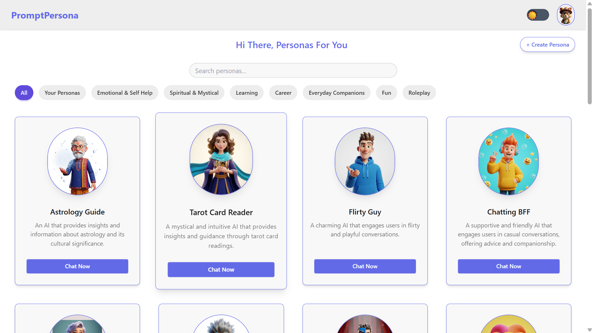

🎨 PromptPersona — Frontend
PromptPersona is a web app that lets users interact with AI personas and even create their own. This frontend is built with React, Vite, Tailwind CSS, DaisyUI, and Redux Toolkit.

🛠️ Tech Stack
        Tech	                    Purpose
    React + Vite	Fast, modern frontend framework
    Tailwind CSS	Utility-first CSS styling
    DaisyUI	Component library for Tailwind
    Redux Toolkit	Global state management
    Axios	API communication wrapper

📁 Project Structure
    📦src
    ┣ 📂components         # Shared UI components (Navbar, PersonaCard, etc.)
    ┣ 📂pages              # Route-level components (Home, Auth, EditProfile, etc.)
    ┣ 📂redux              # Redux slices (auth, etc.)
    ┣ 📂utils              # Axios wrapper and helpers
    ┣ App.jsx             # Main layout + routing
    ┗ main.jsx            # Root render with Redux Provider

🔓 Authentication Flow
    User can sign up or log in via /auth route

    Uses JWT stored in HttpOnly cookie

    On page load, /profile is auto-fetched to check active session

    Redux slice manages auth state:

    setCredentials() on login

    logout() clears state + cookie

    /edit page is protected unless user is logged in

✏️ Edit Profile Page
    Route: /edit-profile

    Form includes:

        Name

        Age

        Gender (Male / Female / Other)

        Avatar displayed based on gender:

            👦 avatarB.png

            👧 avatarG.png

            🐯 animal-avatar.png

    PUT request to /profile/edit updates DB

    Redux state is updated upon success

    Success toast notification shown

🧠 AI Personas (Home Page)
    Route: /

    Loads both:

        Default personas (static)

        User-created personas (from DB)

    Search bar and category filters

    Click a card → starts chat via /chat/start

💬 AI Chat Interface
    Chat-like UI for each persona

    Typing indicator ("Typing...") shown during AI generation

    Messages saved and displayed in conversation format

    AI reply is fetched via /ai/generate (handled in backend)

✨ UX Enhancements
    Gender-based avatars with colorful rings

    Theme toggle (🌙 / ☀️)

    Animated toasts on profile save or error

    Beautiful and consistent layout using Tailwind + DaisyUI

🔐 Pages & Routes
        Route	                  Description
        /	                    Explore all personas
        /auth	                Login/Signup
        /edit-profile	        Edit user info + avatar logic
        /personas/custom	    Create a custom AI persona
        /chat/start	            Chat UI with selected persona

🧠 Author & Credits
Built by Vaishnavi (2025)

AI generation powered by Google Gemini (via backend)

UI inspired by modern chatbot experiences

